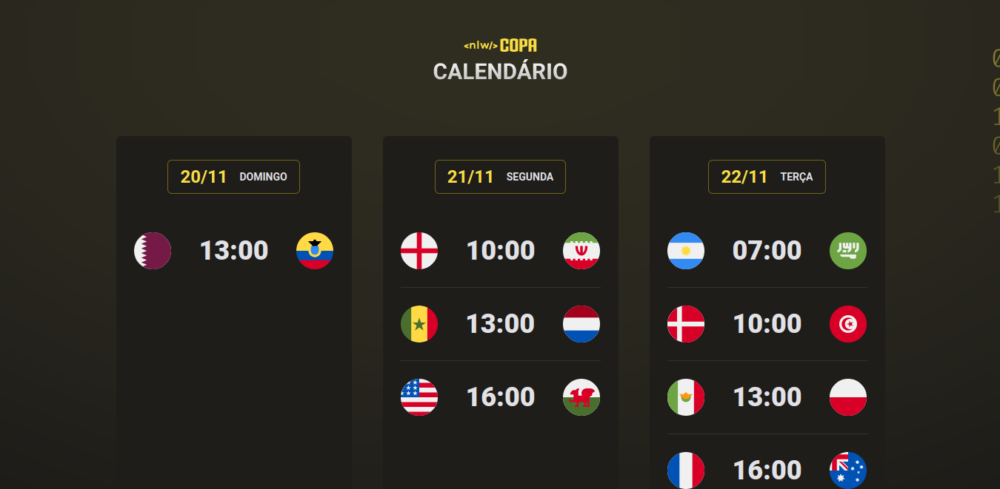

<h1 align="center"> NLW #10 Copa </h1>

  Evento exclusivo e gratuito, promovido pela Rocketseat para ensino de tecnologias WEB.

  <a href="#-tecnologias">Tecnologias</a>&nbsp;&nbsp;&nbsp;|&nbsp;&nbsp;&nbsp;
  <a href="#-projeto">Projeto</a>&nbsp;&nbsp;&nbsp;|&nbsp;&nbsp;&nbsp;
  <a href="#-deploy">Deploy</a>&nbsp;&nbsp;&nbsp;|&nbsp;&nbsp;&nbsp;
  <a href="#-layout">Layout</a>&nbsp;&nbsp;&nbsp;|&nbsp;&nbsp;&nbsp;
  <a href="#memo-licença">Licença</a>

  

 

  

## 🚀 Tecnologias

Esse projeto foi desenvolvido com as seguintes tecnologias:

- HTML e CSS
- JavaScript e JSON
- [Node e NPM](https://nodejs.org/)
- [Vite](https://vitejs.dev/)
- [World Cup API](https://github.com/liverday/world-cup-api)

## 💻 Projeto

O Copa Calendar é um site dinâmico que mostra todos os jogos da Copa do Mundo 2022, com transições e animações com o tema do azul, verde e amarelo. Com a criação de componentes via Javascript que deixa tudo mais fácil de mudar posteriormente.

## ✈️ Deploy

Hospedado na Vercel, plataforma que eu recomendo. [Aqui o link!](https://copacalendar-poveii.vercel.app/)

## 🔖 Layout

Você pode visualizar o layout do projeto através [DESSE LINK](https://www.figma.com/file/5YszDTpZGNscy6ykzQ8VEX/Calend%C3%A1rio-de-Jogos-Community/duplicate). É necessário ter conta no [Figma](https://figma.com) para acessá-lo.

## :memo: Licença

Esse projeto está sob a licença MIT.

---

Feito com 💜 by Poveii
